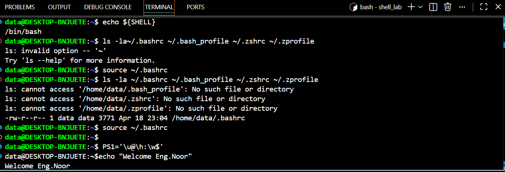
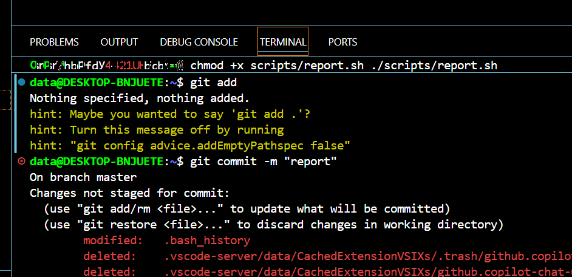

## اهم الاوامر التي تم تنفيذها وهي:
## 1- امر البء
git init
## (يضيف ملف ) امر التحضير
git add lab-report.md
## امر حفظ(يحفظ التغيرات في سجل النظام)
git commit -m "first commit"
## امر عرض الحالة(التحقق من حالة الملفات ومعرفة اذا كانت محفوظة او معدلة)
git status
## امر الرفع(ارسال الملفات من جهاز محلي الى GitHub)
git push prigin main
##  لمعرفة المسار الحالي 
pwd
mkdir -p ~/shell_lab/{notes,scripts,data}
## لعرض الملفات والمجلدات داخل المسار الحالي
ls -la ~/.bashrc ~/.bash_profile ~/.zshrc ~/.zprofile
## للتنقل بين المجلدات
mkdir project
## لانشاء مجلد جديد باسم
touch file.txt

